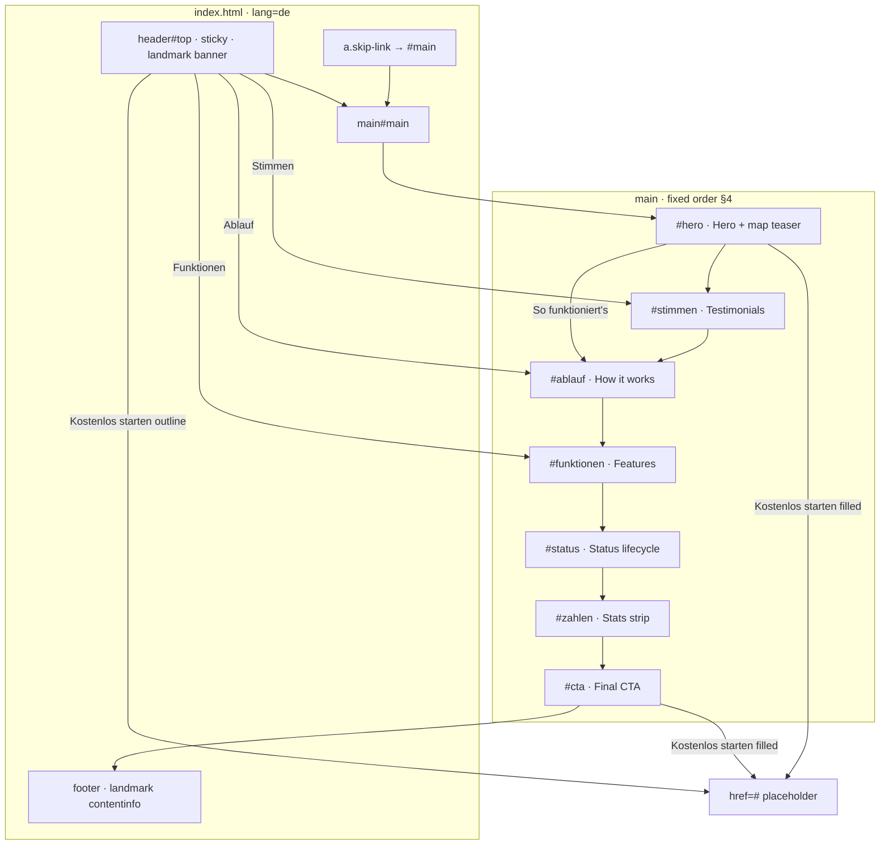
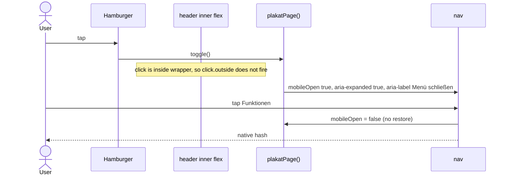
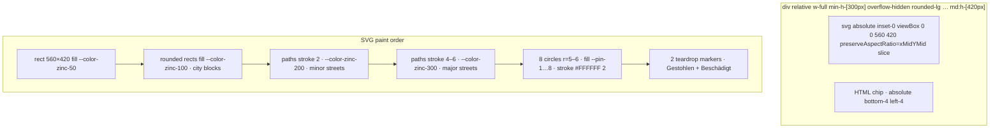
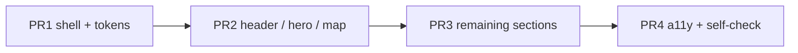

# Plakatradar Landing Page — Implementation Design

| Field | Value |
| --- | --- |
| Author | TBD |
| Date | 2026-08-31 |
| Status | Draft |
| Briefing | [`design-briefing.md`](../../../../Users/fvh/.dots/herdr/.herdr/worktrees/DesignTest/grok46/design-briefing.md) v1.0 (source of truth) |
| Workspace | `/Users/fvh/.dots/herdr/.herdr/worktrees/DesignTest/grok46` |
| Deliverable | single self-contained `index.html` (light mode) |

This document is the **engineering spec** for implementing the locked visual/UX contract in `design-briefing.md`. Hex values, fixed German strings, section order, and component anatomy are adopted **verbatim**. Inner layout, MAY microcopy, and per-interaction JS library choice are decided here so an implementer (or `/execute-plan`) can ship without re-litigating the briefing.

---

## Overview

Plakatradar is a fictional multi-party campaign-poster map app. This task is **not** that app: it is a design-eval sandbox landing page that explains the product and converts to “Kostenlos starten”. The workspace currently contains only the briefing (`design-briefing.md` v1.0), the plan that produced it (`.plans/design-briefing-landingpage.md`), `README.md`, `prompt.md`, and `.gitignore`. There is **no** `index.html`, no `package.json`, no build tooling, and no backend.

The proposed implementation is one semantic HTML file: Tailwind CSS v4 via Play CDN, Inter via Google Fonts, Alpine.js v3 via CDN for client state (sticky header, hamburger, optional scroll-spy). No htmx (no server). No other frameworks. No build step. Tokens from briefing §6–§7 map 1:1 onto `@theme` + `:root` custom properties and a closed set of Tailwind utilities. The map teaser is an inlined decorative SVG (8 pin-swatch dots + 2 status teardrops + Musterstadt chip). Copy is German, du-form, with German number formatting.

---

## Background & Motivation

**Current state on disk.** `README.md` describes DesignTest as a comparison sandbox: several models receive one identical briefing and each delivers a landing page. The briefing is complete (brand, ~30 hex colors, px/rem tokens, 10 components, 9-section page map, MUST/MAY, 16-item self-check). The implementation has not been started.

**Pain this spec removes.** The briefing is a visual contract, not an HTML architecture. Without this document, implementers independently invent:

- token → utility mapping (risk: `text-4xl` is 36 px, not the required 40 px)
- Alpine vs htmx per interaction (htmx has no job on a static page)
- map construction (real tiles, attribution, login chrome — all forbidden)
- extra filled CTAs in the header
- English copy or `12,480` number formatting
- semantic greens/reds used as decoration
- a second CSS framework or a build step

**Why a single file.** Briefing §1 and README fix the stack: one `index.html`, Tailwind via CDN `<script>`, JS only via Alpine.js and/or htmx via CDN. Co-located assets are allowed only if strictly necessary; SVG and icons are inlined so the eval artifact is one file.

---

## Goals & Non-Goals

### Goals

- Ship one responsive light-mode landing page, 360–1440 px, that satisfies briefing §10 (all 16 checks “met”).
- Preserve briefing MUST values 1:1: hex codes, fixed strings, 9-section order, Inter 400/500/600, 4 px spacing grid, container 1152 px, two-element section pattern.
- Encode tokens so implementers cannot invent utilities (mapping table in this doc).
- Encode interactions (sticky header, hamburger, hash anchors, scroll-spy, reduced-motion) with a library choice and rationale per interaction.
- Keep fiction: Musterstadt / Musterstadt-Land / Nordstadt only; no real parties, people, places, brands, or map services.
- Verify before delivery with the §10 checklist plus a forbidden-string grep and viewport QA.

### Non-Goals

- The Plakatradar app itself (auth, PWA, GPS, photo upload, live map, nearby, offline).
- Any backend, API, database, analytics pixel, or real registration endpoint.
- Dark mode / `prefers-color-scheme` branching / theme switcher.
- Pricing, comparison tables, superlatives, political siding.
- Build step, bundler, npm, PostCSS, TypeScript, React/Vue/Svelte, Leaflet, or extra CSS frameworks.
- Real map tiles, geocoding, or map-provider UI chrome.
- Legal pages: Impressum / Datenschutz are `href="#"` placeholders.
- Splitting CSS/JS into extra files, unless a strictly necessary static asset is unavoidable (prefer none).

---

## Key Decisions

| # | Decision | Rationale |
| --- | --- | --- |
| K1 | **One file: `index.html`.** Inline the map SVG, icon SVGs, `:root` tokens, Alpine component, and favicon data-URI. | Briefing deliverable is a single self-contained page. Extra files add eval friction and are unnecessary. |
| K2 | **Tailwind CSS v4 Play CDN** (`@tailwindcss/browser@4`) + `@theme` token aliases + a parallel `:root` block. | Matches “Tailwind via CDN `<script>`, no build step”. `@theme` gives named utilities (`bg-brand`). `:root` is required for SVG `fill`/`stroke` that utilities do not reach. Do **not** rely on default palette *names* for brand / semantic / pin colors (drift); zinc defaults currently match §6.2 hex and may be used after a 1:1 check. |
| K3 | **Alpine.js v3 only. Do not load htmx.** State lives in `x-data="plakatPage()"` on `<body>`. Do **not** use `Alpine.data` / `alpine:init` (CDN `defer` races that listener). | Every required interaction is client state or native HTML. htmx needs a server. `Alpine.data` plus a deferred listener after the CDN tag registers too late; a factory function defined in a **sync** `<script>` *before* the deferred Alpine tag has no race. |
| K4 | **Native hash navigation** for “Funktionen · Ablauf · Stimmen” and “So funktioniert's”. No JS router. | Anchors work without JS, are keyboard-native, and survive Alpine failure. |
| K5 | **Map teaser = inline decorative SVG** (not CSS-only, not ``, not a map library). 8 circle pins (swatches) + 2 teardrop status pins + HTML chip “248 Pins in Musterstadt”. Box: `min-h-[300px]` / `md:h-[420px]`; SVG `preserveAspectRatio="xMidYMid slice"` so the 560×420 art is never squashed. All 10 markers sit in viewBox **x = 130–430** so `slice` at 768 (~340×420) and 1024 (~464×420) does not crop them. | Briefing §8.6 requires abstract streets, distinguishable status-pin *shape*, ~8 swatches visible, height ≥ 300 px, and a Musterstadt chip. Slice + overflow-hidden fills the box; `meet` would letterbox below 300 px at 360. |
| K6 | **Header CTA is always secondary (outline) and `hidden md:inline-flex`.** Below `md` the only header-bar CTA is inside the mobile panel (also secondary). Filled primary exists only in the hero button pair and the final CTA block — two instances in the document. | Briefing §6.6 / §8.1. 360 px cannot fit wordmark + 44×44 hamburger + outline CTA; the panel already contains the CTA. |
| K7 | **Status lifecycle is a set of fictional `Plakat-Eintrag` records** (cards), not a timeline. | Briefing MAY on presentation; cards reuse §8.4/§8.5 tokens, make combinations obvious, and avoid fake app-screen chrome. |
| K8 | **“Kostenlos starten” `href="#"`** (sandbox placeholder). Secondary process CTA `href="#ablauf"`. Legal links `href="#"`. Do not `preventDefault`. Known side effect: native `#` jumps to the page top; acceptable for this eval. Optional equivalent: `href="#top"` (`id="top"` is already on the header). No `role="button"`. | No registration backend exists. Do not invent a fake form or a silent JS no-op. |
| K9 | **Google Fonts Inter 400/500/600 only** (exact hrefs in Stack). Fallback `system-ui, sans-serif`. No icon-font CDN; icons are 24 px stroke inline SVGs in `#6D28D9`. | Inter is MUST. An icon library is MAY; inlining keeps the page self-contained. No `700` in the font URL. |
| K10 | **Animations: CSS state transitions ≤ 200 ms only.** Optional pin pulse is allowed, gated by `prefers-reduced-motion`. Count-up and hero entrance are **off**. | Count-up risks layout shift (§8.7). Motion is MAY, not scored; reduced-motion must be respected. |
| K11 | **Nav label order ≠ DOM order.** Nav: Funktionen → Ablauf → Stimmen. DOM: Stimmen (`#stimmen`) → Ablauf (`#ablauf`) → Funktionen (`#funktionen`). | Briefing §3 / §4 / §5. Do not reorder sections to match the nav. |
| K12 | **`lang="de"`**, du-form MAY copy locked in the content inventory, numbers as `12.480` / `1.270`. Apostrophe in the secondary CTA is the §3 glossary form: `So funktioniert's` (ASCII). | Prevents English leakage, comma-thousands, and mixed apostrophes (`'` vs `’`) found across briefing sections. |
| K13 | **Mobile menu is a dropdown, not a modal.** `absolute` panel under the sticky header, no backdrop, no `role="dialog"`, no focus trap, no `inert`, no scroll-lock. `@click.outside` lives on the wrapper that **includes** the hamburger (never on the panel alone). | Briefing §8.1 “dropdown/overlay”. A panel-only `.outside` closes on the opening tap. A dialog would require a focus trap this page does not load a library for. |
| K14 | **CTA class strings are frozen utilities.** No `btn-primary` / `btn-secondary` / `@apply` / `@utility`. Copy the snippets in “Button classes”. | Play CDN must see full class names in the HTML. Named components without `@utility` 404 at runtime and filled-CTA grep depends on `bg-brand` + `text-white` staying literal. |

---

## Proposed Design

### Current → target artifact

```
DesignTest/grok46/          (today)
├── README.md
├── design-briefing.md      ← visual/UX contract (do not edit for this work)
├── prompt.md
└── .plans/design-briefing-landingpage.md

DesignTest/grok46/          (after implementation)
├── …unchanged…
└── index.html              ← the only new file
```

Serve with `open index.html` or `python3 -m http.server 8080` from the repo root. CDN scripts need a network; file:// works for HTML/CSS review but some browsers restrict module-style CDNs — prefer a tiny static server for QA.

### Stack (frozen)

| Layer | Choice | Pin |
| --- | --- | --- |
| HTML | Semantic HTML5, `lang="de"` | — |
| CSS | Tailwind v4 Play CDN | `https://cdn.jsdelivr.net/npm/@tailwindcss/browser@4` |
| Tokens | `<style type="text/tailwindcss">` `@theme` + `<style>` `:root` | briefing §7.6 values |
| Font | Inter 400/500/600 (no 700) | Google Fonts CSS2, exact hrefs below |
| JS | Alpine.js 3.x `defer` | `https://cdn.jsdelivr.net/npm/alpinejs@3.14.9/dist/cdn.min.js` |
| htmx | **not included** | — |
| Icons / map | Inline SVG | — |

**Head order (required, top to bottom):** charset → viewport → title → description → Inter (two preconnects + stylesheet) → Tailwind Play CDN `<script>` → `<style type="text/tailwindcss">` `@theme` **without** `@import "tailwindcss"` → unlayered `<style>` with `:root` + Base CSS → **sync** `<script>` defining `window.plakatPage` → **deferred** Alpine CDN `<script>`. No third JS file. No `alpine:init` listener.

Exact Inter tags (copy verbatim; no `700`):

```html
<link rel="preconnect" href="https://fonts.googleapis.com" />
<link rel="preconnect" href="https://fonts.gstatic.com" crossorigin />
<link rel="stylesheet" href="https://fonts.googleapis.com/css2?family=Inter:wght@400;500;600&display=swap" />
```

Exact JS tags, **this order**:

```html
<script>
  window.plakatPage = function () {
    return {
      mobileOpen: false,
      scrolled: false,
      active: "",
      toggle() {
        this.mobileOpen = !this.mobileOpen;
      },
      close() {
        this.mobileOpen = false;
        this.$nextTick(() => {
          if (this.$refs.menuBtn) this.$refs.menuBtn.focus();
        });
      },
      init() {
        const ratios = { stimmen: 0, ablauf: 0, funktionen: 0 };
        const io = new IntersectionObserver(
          (entries) => {
            entries.forEach((e) => {
              ratios[e.target.id] = e.isIntersecting ? e.intersectionRatio : 0;
            });
            let id = "";
            let best = 0;
            for (const key of ["stimmen", "ablauf", "funktionen"]) {
              if (ratios[key] > best) {
                best = ratios[key];
                id = key;
              }
            }
            this.active = best > 0 ? id : "";
          },
          { rootMargin: "-35% 0px -55% 0px", threshold: [0, 0.25, 0.5, 1] }
        );
        ["stimmen", "ablauf", "funktionen"].forEach((id) => {
          const el = document.getElementById(id);
          if (el) io.observe(el);
        });
      },
    };
  };
</script>
<script defer src="https://cdn.jsdelivr.net/npm/alpinejs@3.14.9/dist/cdn.min.js"></script>
```

`plakatPage` is a plain factory, **not** `Alpine.data`. The sync script runs at parse time (before `</head>` finishes). Alpine `defer` boots after the document is parsed and evaluates `x-data="plakatPage()"` — the function already exists. Scrolled chrome is **only** `@scroll.window.passive` on `<body>` (do not also add a scroll listener in `init()`).

### Page architecture



### Two-element section pattern (all 9 regions)

Every section, the header, and the footer use the same skeleton. Outer node owns **background + vertical padding**. Inner node owns **max-width 1152 px, centering, horizontal padding**. Content edges then align while scrolling (briefing §7.2).

```html
<section id="ablauf" class="bg-white py-12 md:py-24" aria-labelledby="ablauf-heading">
  <div class="mx-auto w-full max-w-[1152px] px-6 md:px-8">
    <!-- heading group + content -->
  </div>
</section>
```

| Region | Outer background | Vertical padding |
| --- | --- | --- |
| Header | `#FFFFFF` (scrolled: same + border `#E4E4E7` + `shadow-sm`) | ~16 px (inner height ≈ 64–72 px) |
| Hero | `#FFFFFF` | `py-12 md:py-24` |
| Testimonials | `#FAFAFA` | `py-12 md:py-16` |
| How it works | `#FFFFFF` | `py-12 md:py-24` |
| Features | `#FFFFFF` | `py-12 md:py-24` |
| Status lifecycle | `#FFFFFF` | `py-12 md:py-24` |
| Stats | `#FAFAFA` | `py-12 md:py-16` |
| Final CTA | `#FFFFFF` | `py-12 md:py-24`; **inner panel** `#F5F3FF` `rounded-[20px] p-12 md:p-16` |
| Footer | `#FAFAFA` + top border `#E4E4E7` | `py-12 md:py-16` |

Horizontal padding is `px-6` (24 px) below `md`, `px-8` (32 px) from `md` up. Grid gap is **24 px everywhere** (`gap-6`). Every in-page region that can be a hash target (and the hero, for consistency) carries **`scroll-mt-20` in the markup from PR 1** so the sticky header does not cover headings: `#hero`, `#stimmen`, `#ablauf`, `#funktionen`, `#status`, `#zahlen`, `#cta`.

### Document skeleton

```html
<!DOCTYPE html>
<html lang="de">
<head>
  <meta charset="utf-8" />
  <meta name="viewport" content="width=device-width, initial-scale=1" />
  <title>Plakatradar — Jedes Plakat. Ein Pin. Eine Karte.</title>
  <meta name="description" content="Plakatradar: jedes Plakat als Pin auf einer Karte. Für Wahlkampfteams aller Parteien. Kostenlos starten." />
  <link rel="icon" href="data:image/svg+xml,..." />
  <link rel="preconnect" href="https://fonts.googleapis.com" />
  <link rel="preconnect" href="https://fonts.gstatic.com" crossorigin />
  <link rel="stylesheet" href="https://fonts.googleapis.com/css2?family=Inter:wght@400;500;600&display=swap" />
  <script src="https://cdn.jsdelivr.net/npm/@tailwindcss/browser@4"></script>
  <style type="text/tailwindcss">
    /* @theme only — no @import "tailwindcss" (Play CDN injects it). */
    /* Radius override: rounded-md = 12px, rounded-lg = 20px (not Tailwind defaults). */
    @theme { /* see Token mapping */ }
  </style>
  <style>
    /* :root pins + Base CSS (lock) — see below */
  </style>
  <script>
    window.plakatPage = function () { /* see Stack */ };
  </script>
  <script defer src="https://cdn.jsdelivr.net/npm/alpinejs@3.14.9/dist/cdn.min.js"></script>
</head>
<body
  class="bg-white font-sans text-base text-zinc-700 antialiased"
  x-data="plakatPage()"
  @scroll.window.passive="scrolled = window.scrollY > 8"
>
  <a class="skip-link" href="#main">Zum Inhalt springen</a>
  <header id="top">…</header>
  <main id="main">
    <section id="hero" class="scroll-mt-20">…</section>
    <section id="stimmen" class="scroll-mt-20">…</section>
    <section id="ablauf" class="scroll-mt-20">…</section>
    <section id="funktionen" class="scroll-mt-20">…</section>
    <section id="status" class="scroll-mt-20">…</section>
    <section id="zahlen" class="scroll-mt-20">…</section>
    <section id="cta" class="scroll-mt-20">…</section>
  </main>
  <footer>…</footer>
</body>
</html>
```

`color-scheme` is **not** set to dark. No `prefers-color-scheme` media query except (allowed) `prefers-reduced-motion`.

### Base CSS (lock) — lives in PR 1

Copy this unlayered `<style>` block next to `:root`. Do not restyle these in PR 4.

```css
:root {
  --color-brand: #6D28D9;
  --color-brand-strong: #5B21B6;
  --color-brand-tint: #F5F3FF;
  --color-zinc-50: #FAFAFA;
  --color-zinc-100: #F4F4F5;
  --color-zinc-200: #E4E4E7;
  --color-zinc-300: #D4D4D8;
  --color-zinc-400: #A1A1AA;
  --color-zinc-500: #71717A;
  --color-zinc-600: #52525B;
  --color-zinc-700: #3F3F46;
  --color-zinc-800: #27272A;
  --color-zinc-900: #18181B;
  --color-status-active: #059669;
  --color-status-active-bg: #ECFDF5;
  --color-status-stolen: #DC2626;
  --color-status-stolen-bg: #FEF2F2;
  --color-status-damaged: #D97706;
  --color-status-damaged-bg: #FFFBEB;
  --color-status-reported: #2563EB;
  --color-status-reported-bg: #EFF6FF;
  --color-status-removed: #52525B;
  --color-status-removed-bg: #F4F4F5;
  --pin-1: #DC2626;
  --pin-2: #EA580C;
  --pin-3: #CA8A04;
  --pin-4: #16A34A;
  --pin-5: #0D9488;
  --pin-6: #2563EB;
  --pin-7: #7C3AED;
  --pin-8: #DB2777;
  --radius-sm: 6px;
  --radius-md: 12px;
  --radius-lg: 20px;
  --radius-pill: 9999px;
  --shadow-sm: 0 1px 2px rgba(24, 24, 27, 0.06);
  --shadow-md: 0 4px 12px rgba(24, 24, 27, 0.08);
  --shadow-lg: 0 12px 32px rgba(24, 24, 27, 0.12);
  --container-max: 1152px;
  --font-sans: "Inter", system-ui, sans-serif;
}

[x-cloak] { display: none !important; }

html { scroll-behavior: smooth; }

.skip-link {
  position: absolute;
  left: 1rem;
  top: 1rem;
  z-index: 60; /* header is z-50 */
  padding: 0.75rem 1.5rem;
  border-radius: 12px;
  background: #6D28D9;
  color: #FFFFFF;
  font: 600 1rem/1.2 "Inter", system-ui, sans-serif;
  text-decoration: none;
  transform: translateY(-200%);
}
.skip-link:focus,
.skip-link:focus-visible {
  transform: none;
  outline: 2px solid #6D28D9;
  outline-offset: 2px;
}

@media (prefers-reduced-motion: reduce) {
  html { scroll-behavior: auto; }
  *, *::before, *::after {
    animation-duration: 0.01ms !important;
    animation-iteration-count: 1 !important;
  }
  /* Do not set transition: none. Color/border hovers ≤ 200 ms stay. Pulse keyframes die via animation-duration. */
}
```

### Token → Tailwind mapping

Implementers use **only** this table. Do not introduce `font-bold` (700), `text-4xl` (36 px), `text-3xl` (30 px), default `shadow-md`, or hex literals outside this set.

#### Color utilities

| Token (briefing) | Hex | Tailwind (preferred) | Also valid |
| --- | --- | --- | --- |
| Brand / primary | `#6D28D9` | `bg-brand` `text-brand` `outline-brand` `fill-brand` | `bg-[#6D28D9]` |
| Brand dark | `#5B21B6` | `bg-brand-strong` `hover:bg-brand-strong` | `bg-[#5B21B6]` |
| Brand tint | `#F5F3FF` | `bg-brand-tint` | `bg-[#F5F3FF]` |
| Page / white | `#FFFFFF` | `bg-white` `text-white` | — |
| zinc-50 | `#FAFAFA` | `bg-zinc-50` | `bg-[#FAFAFA]` |
| zinc-100 | `#F4F4F5` | `bg-zinc-100` | |
| zinc-200 | `#E4E4E7` | `border-zinc-200` `bg-zinc-200` | |
| zinc-300 | `#D4D4D8` | `border-zinc-300` | |
| zinc-400 | `#A1A1AA` | `hover:border-zinc-400` | never body text |
| zinc-500 | `#71717A` | `text-zinc-500` | short secondary only |
| zinc-600 | `#52525B` | `text-zinc-600` | |
| zinc-700 | `#3F3F46` | `text-zinc-700` | |
| zinc-800 | `#27272A` | `text-zinc-800` | |
| zinc-900 | `#18181B` | `text-zinc-900` | H1–H3, primary text, stat values |
| Status Aktiv fg/bg | `#059669` / `#ECFDF5` | `text-status-active` `bg-status-active-bg` | badges + status pins **only** |
| Status Gestohlen | `#DC2626` / `#FEF2F2` | `text-status-stolen` `bg-status-stolen-bg` | badges + status pins **only** |
| Status Beschädigt | `#D97706` / `#FFFBEB` | `text-status-damaged` `bg-status-damaged-bg` | badges + status pins **only** |
| Flag Anzeige | `#2563EB` / `#EFF6FF` | `text-status-reported` `bg-status-reported-bg` | badges **only** |
| Flag Entfernt | `#52525B` / `#F4F4F5` | `text-status-removed` `bg-status-removed-bg` | badges **only** |
| Pin 1–8 | see §6.4 | SVG `fill="var(--pin-N)"` | **never** as text/button/border/decoration |

`@theme` registration (inside `<style type="text/tailwindcss">`):

```css
/* Play CDN: do NOT @import "tailwindcss" — the browser build already injects it (double preflight if imported). */
/* Radius override: rounded-md = 12px (buttons, icon tiles); rounded-lg = 20px (cards, map, menu, CTA). */
@theme {
  --font-sans: "Inter", system-ui, sans-serif;
  --color-brand: #6D28D9;
  --color-brand-strong: #5B21B6;
  --color-brand-tint: #F5F3FF;
  --color-status-active: #059669;
  --color-status-active-bg: #ECFDF5;
  --color-status-stolen: #DC2626;
  --color-status-stolen-bg: #FEF2F2;
  --color-status-damaged: #D97706;
  --color-status-damaged-bg: #FFFBEB;
  --color-status-reported: #2563EB;
  --color-status-reported-bg: #EFF6FF;
  --color-status-removed: #52525B;
  --color-status-removed-bg: #F4F4F5;
  --shadow-sm: 0 1px 2px rgb(24 24 27 / 0.06);
  --shadow-md: 0 4px 12px rgb(24 24 27 / 0.08);
  --shadow-lg: 0 12px 32px rgb(24 24 27 / 0.12);
  --radius-sm: 6px;
  --radius-md: 12px;
  --radius-lg: 20px;
  --radius-pill: 9999px;
}
```

The unlayered `:root` in **Base CSS (lock)** copies briefing §7.6 including `--pin-1`…`--pin-8`, so SVG `fill="var(--pin-N)"` resolves. `@theme` does **not** register pin colors as `--color-*` (they must never become `bg-pin-1`).

Zinc check (Tailwind default ≡ briefing §6.2): 50 `#FAFAFA`, 100 `#F4F4F5`, 200 `#E4E4E7`, 300 `#D4D4D8`, 400 `#A1A1AA`, 500 `#71717A`, 600 `#52525B`, 700 `#3F3F46`, 800 `#27272A`, 900 `#18181B`. If a future CDN default drifts, switch those utilities to arbitrary hex.

#### Typography

| Token | px | Utility | Weight utility | Usage |
| --- | --- | --- | --- | --- |
| `text-60` | 60 | `text-[60px]` or `text-6xl` (3.75 rem) | `font-semibold` | H1 from `md` |
| `text-40` | 40 | `text-[40px]` **not `text-4xl`** | `font-semibold` | H1 mobile; H2 desktop |
| `text-32` | 32 | `text-[32px]` **not `text-3xl`** | `font-semibold` | H2 mobile; stats value desktop |
| `text-24` | 24 | `text-2xl` | `font-semibold` | H3 |
| `text-18` | 18 | `text-lg` | `font-normal` / `font-medium` / `font-semibold` | lead, subline, wordmark, card titles |
| `text-16` | 16 | `text-base` | `font-normal` | body; button label `md` |
| `text-14` | 14 | `text-sm` | `font-normal` / `font-medium` | nav, labels, attribution, panel links |
| `text-12` | 12 | `text-xs` | `font-medium` / `font-semibold` | eyebrow, badge, chip, copyright |

Line-height: headings `leading-[1.15]`; body `leading-relaxed` (≈ 1.625, within §7.1 ≈ 1.6). Headings add `text-balance`; paragraphs add `text-pretty`. **Never `font-bold`.**

Eyebrow (page-wide, one style):

```
text-xs font-semibold tracking-[0.08em] uppercase text-brand
```

#### Spacing, radius, shadow, layout

| Token | px | Utility |
| --- | --- | --- |
| `space-1` | 4 | `p-1` `gap-1` (badge y-padding) |
| `space-2` | 8 | `p-2` `gap-2` |
| `space-3` | 12 | `p-3` `px-3` (badge x-padding) |
| `space-4` | 16 | `p-4` `gap-4` |
| `space-6` | 24 | `p-6` `gap-6` `px-6` |
| `space-8` | 32 | `p-8` `px-8` `md:px-8` |
| `space-12` | 48 | `p-12` `py-12` |
| `space-16` | 64 | `p-16` `md:py-16` |
| `space-24` | 96 | `md:py-24` |
| `radius-sm` | 6 | `rounded-sm` (after `@theme`) or `rounded-[6px]` |
| `radius-md` | 12 | `rounded-md` (after `@theme`) or `rounded-xl` (default 12 px) |
| `radius-lg` | 20 | `rounded-lg` (after `@theme`) or `rounded-[20px]` — **not** default `rounded-2xl` (16) / `rounded-3xl` (24) |
| `radius-pill` | 9999 | `rounded-full` |
| `shadow-sm/md/lg` | zinc-tinted | `shadow-sm` `shadow-md` `shadow-lg` **after** `@theme` override |
| Container | 1152 | `max-w-[1152px]` (Tailwind `max-w-6xl` is 72 rem = 1152 px; either is fine if verified) |
| Breakpoints | 640 / 768 / 1024 / 1280 | `sm:` `md:` `lg:` `xl:` (defaults match §7.5) |

`@theme` redefines `--radius-sm/md/lg` to 6/12/20 so `rounded-md` = 12 px (buttons, icon tiles) and `rounded-lg` = 20 px (cards, map, menu, CTA panel). Document this in a comment at the top of the `@theme` block so reviewers do not “fix” radii back to Tailwind defaults.

#### Focus ring (global)

All links, buttons, and the hamburger share this frozen substring (append it; do not omit it from copy-paste HTML):

```
focus-visible:outline focus-visible:outline-2 focus-visible:outline-offset-2 focus-visible:outline-brand
```

That includes: desktop nav, **mobile-panel hash links**, panel/header/hero/final CTAs, footer `Funktionen` / `Ablauf` / `Stimmen` / `Impressum` / `Datenschutz`, `Zum Statusmodell`, and the wordmark. Frozen **text-link** class for footer and any other zinc hash link:

```
text-sm font-medium text-zinc-600 hover:text-zinc-900 focus-visible:outline focus-visible:outline-2 focus-visible:outline-offset-2 focus-visible:outline-brand
```

Optional base CSS: `*:focus { outline: none }` is **forbidden** unless paired with the `focus-visible` rule above. Prefer adding the utilities on interactive elements rather than a global outline killer.

### Interaction matrix (Alpine vs htmx vs native)

| Interaction | Choice | Why | Implementation notes |
| --- | --- | --- | --- |
| Sticky header | **CSS** `sticky top-0 z-50` | No JS required for stickiness. | Header is `position: sticky`, not `fixed`, so it stays in document flow. |
| Header scrolled chrome (border + `shadow-sm`, optional blur) | **Alpine** `@scroll.window.passive` on `<body>` | Binary state from `window.scrollY > 8`. htmx cannot observe scroll. | **One** binding: `@scroll.window.passive="scrolled = window.scrollY > 8"` on `<body>`. Do **not** also `addEventListener('scroll')` in `init()`. `:class` on `<header>`. Optional `bg-white/90 backdrop-blur` is MAY; if used, keep text contrast AA. |
| Desktop vs mobile nav | **CSS** `hidden md:flex` / `md:hidden` | Breakpoint `md` = 768 px matches §7.5 / §8.1. | Hamburger `h-11 w-11` (≥ 44×44). Header CTA `hidden md:inline-flex`. |
| Hamburger open/close | **Alpine** `mobileOpen` boolean | Classic client widget. htmx would need a server fragment. Checkbox hack is the CSS-only alternative (see Alternatives). | Open: hamburger `toggle()`. Close: icon-as-X, nav/CTA tap (`mobileOpen = false`, no restore), outside tap, Escape. **Do not put `@click.outside` on `#mobile-menu` alone** — the opening click is outside that node and immediately `close()`s. Put `@click.outside="mobileOpen && close()"` on the wrapper that contains **hamburger + panel** (the header inner `relative` flex). `aria-expanded` + `:aria-label` swap. No mega menu. No backdrop. |
| Nav + “So funktioniert's” | **Native** `<a href="#funktionen\|#ablauf\|#stimmen">` | Works without JS; briefing wants real anchors. | `scroll-behavior: smooth` on `html`, disabled under `prefers-reduced-motion`. |
| Active section (scroll-spy) | **Alpine** `IntersectionObserver` in `plakatPage().init()` | Optional visual (`text-brand` on the matching nav item, §8.1 “optionally”). | Observe `#stimmen`, `#ablauf`, `#funktionen`. Persist ratios across callbacks; pick the id with greatest `intersectionRatio`. If all ratios are 0 (hero, `#status`, `#zahlen`, `#cta`), set `active = ''`. |
| Primary CTA uniqueness | **Markup convention**, not JS | Two filled buttons exist (hero, final CTA). Header is outline. Other sections have no filled buttons. | QA at 360/768/1024/1440: header + hero share the first view (outline + filled = OK). Header + final CTA share the last view. Never a third filled button. |
| Pin pulse | **CSS** `@keyframes` + `motion-safe:` | MAY. Must not run under reduced motion. | Apply to status teardrops only (or all pins at low amplitude). Duration ≥ 2 s, opacity/scale only, no layout shift. |
| Count-up stats | **Do not implement** | §8.7 MAY but “never layout shift”. Extra JS for a sandbox eval is unjustified. | Render final values immediately (`12.480`, …). |
| Hero entrance | **Do not implement** | MAY; not in §10. | Static hero. |
| Reduced motion | **CSS** `@media (prefers-reduced-motion: reduce)` in Base CSS (lock) | A11y MUST-adjacent. | `html { scroll-behavior: auto }`; kill **animations** via `animation-duration: 0.01ms`. Do **not** set `transition: none` — color/border hovers ≤ 200 ms remain. |

Alpine state is `window.plakatPage` as locked under Stack. There is no `alpine:init` handler and no second deferred script.

### Header / mobile menu

Anatomy (briefing §8.1) — locked geometry:

- Sticky header: `sticky top-0 z-50 bg-white`. Inner two-element container is **`relative`** (positioning context for the dropdown).
- Inner flex: `mx-auto flex h-16 w-full max-w-[1152px] items-center justify-between gap-3 px-6 md:px-8`.
- Left: wordmark = pin glyph (inline SVG, fill `#6D28D9`, 20×20) + text `Plakatradar` (`text-lg font-semibold text-zinc-900 shrink-0`).
- Center (from `md`): three anchors in **fixed order** `Funktionen` · `Ablauf` · `Stimmen` (`hidden md:flex items-center gap-8`, frozen text-link class including `focus-visible:*`). Active = `text-brand`. Do not include the `·` characters inside the link text.
- Desktop CTA (from `md`): secondary “Kostenlos starten”, **`hidden md:inline-flex`**, frozen secondary class string. **Never** filled primary. **Never** shown below `md`.
- Mobile (below `md`): hamburger only in the bar (`md:hidden`, `h-11 w-11`). The panel holds the stacked nav + the **only** mobile “Kostenlos starten” (secondary, `w-full`).
- Dropdown (not modal): `#mobile-menu` is `absolute inset-x-6 top-full z-50 mt-2 rounded-lg bg-white p-6 shadow-lg`. No backdrop, no `role="dialog"` / `role="menu"`, no focus trap, no `inert`, no scroll-lock. `x-show="mobileOpen"` + `x-cloak`. It is a `<nav aria-label="Mobilnavigation">`.
- Close: hamburger icon swaps to X (`:aria-label="mobileOpen ? 'Menü schließen' : 'Menü öffnen'"`); link/CTA tap sets `mobileOpen = false` (do **not** call `close()`, so focus stays on the link / follows the hash); Escape and outside click call `close()` which restores focus to `x-ref="menuBtn"`.
- `@click.outside` **on the inner header flex** (hamburger + panel + wordmark). Never on `#mobile-menu` alone.

```html
<header
  id="top"
  class="sticky top-0 z-50 bg-white"
  :class="scrolled && 'border-b border-zinc-200 shadow-sm'"
>
  <div
    class="relative mx-auto flex h-16 w-full max-w-[1152px] items-center justify-between gap-3 px-6 md:px-8"
    @click.outside="mobileOpen && close()"
    @keydown.escape.window="mobileOpen && close()"
  >
    <a href="#top" class="flex shrink-0 items-center gap-2 text-lg font-semibold text-zinc-900 focus-visible:outline focus-visible:outline-2 focus-visible:outline-offset-2 focus-visible:outline-brand">
      <!-- 20×20 pin glyph, fill #6D28D9 -->
      Plakatradar
    </a>

    <nav class="hidden items-center gap-8 md:flex" aria-label="Hauptnavigation">
      <a href="#funktionen" class="text-sm font-medium text-zinc-600 hover:text-zinc-900 focus-visible:outline focus-visible:outline-2 focus-visible:outline-offset-2 focus-visible:outline-brand" :class="active === 'funktionen' && 'text-brand'">Funktionen</a>
      <a href="#ablauf" class="text-sm font-medium text-zinc-600 hover:text-zinc-900 focus-visible:outline focus-visible:outline-2 focus-visible:outline-offset-2 focus-visible:outline-brand" :class="active === 'ablauf' && 'text-brand'">Ablauf</a>
      <a href="#stimmen" class="text-sm font-medium text-zinc-600 hover:text-zinc-900 focus-visible:outline focus-visible:outline-2 focus-visible:outline-offset-2 focus-visible:outline-brand" :class="active === 'stimmen' && 'text-brand'">Stimmen</a>
    </nav>

    <!-- desktop CTA: secondary, frozen string + hidden md:inline-flex; href="#" jumps to page top (documented) -->
    <a href="#" class="hidden md:inline-flex items-center justify-center rounded-md border border-zinc-300 bg-white px-6 py-3 text-base font-semibold text-zinc-900 hover:border-zinc-400 hover:bg-zinc-50 active:border-zinc-500 focus-visible:outline focus-visible:outline-2 focus-visible:outline-offset-2 focus-visible:outline-brand">Kostenlos starten</a>

    <button
      type="button"
      class="inline-flex h-11 w-11 items-center justify-center rounded-md text-zinc-900 md:hidden focus-visible:outline focus-visible:outline-2 focus-visible:outline-offset-2 focus-visible:outline-brand"
      x-ref="menuBtn"
      :aria-expanded="mobileOpen"
      :aria-label="mobileOpen ? 'Menü schließen' : 'Menü öffnen'"
      aria-controls="mobile-menu"
      @click="toggle()"
    >
      <!-- 24 px stroke icon; swap to X when mobileOpen -->
    </button>

    <nav
      id="mobile-menu"
      class="absolute inset-x-6 top-full z-50 mt-2 rounded-lg bg-white p-6 shadow-lg md:hidden"
      x-show="mobileOpen"
      x-cloak
      aria-label="Mobilnavigation"
    >
      <div class="flex flex-col gap-2">
        <a href="#funktionen" class="flex min-h-11 items-center text-sm font-medium text-zinc-600 hover:text-zinc-900 focus-visible:outline focus-visible:outline-2 focus-visible:outline-offset-2 focus-visible:outline-brand" @click="mobileOpen = false">Funktionen</a>
        <a href="#ablauf" class="flex min-h-11 items-center text-sm font-medium text-zinc-600 hover:text-zinc-900 focus-visible:outline focus-visible:outline-2 focus-visible:outline-offset-2 focus-visible:outline-brand" @click="mobileOpen = false">Ablauf</a>
        <a href="#stimmen" class="flex min-h-11 items-center text-sm font-medium text-zinc-600 hover:text-zinc-900 focus-visible:outline focus-visible:outline-2 focus-visible:outline-offset-2 focus-visible:outline-brand" @click="mobileOpen = false">Stimmen</a>
        <a href="#" class="mt-2 inline-flex w-full items-center justify-center rounded-md border border-zinc-300 bg-white px-6 py-3 text-base font-semibold text-zinc-900 hover:border-zinc-400 hover:bg-zinc-50 active:border-zinc-500 focus-visible:outline focus-visible:outline-2 focus-visible:outline-offset-2 focus-visible:outline-brand" @click="mobileOpen = false">Kostenlos starten</a>
      </div>
    </nav>
  </div>
</header>
```

At 360 px the bar is wordmark + hamburger only (`justify-between gap-3`). No `whitespace-nowrap` on any CTA label.



### Hero + map teaser construction

Desktop (`md+`): CSS grid two columns, text left, teaser right, `items-center`, gap 24–32 px. Mobile: stacked, text then teaser.

**Teaser box (locked — do not squash the SVG):**

```html
<div class="relative w-full min-h-[300px] overflow-hidden rounded-lg border border-zinc-200 shadow-md md:min-h-0 md:h-[420px]">
  <svg
    class="absolute inset-0 h-full w-full"
    viewBox="0 0 560 420"
    preserveAspectRatio="xMidYMid slice"
    role="img"
    aria-label="Stilisiertes Kartenbild von Musterstadt und Region"
  >
    <!-- layers; inner shapes aria-hidden="true" -->
  </svg>
  <p class="absolute bottom-4 left-4 rounded-full bg-white px-3 py-1 text-xs font-medium text-zinc-900 shadow-sm md:text-sm">248 Pins in Musterstadt</p>
</div>
```

- Mobile: `min-h-[300px]` satisfies briefing height ≥ 300 px. A 4:3 `meet` box at 360 px would be ~234 px tall — too short — so **do not** use `aspect-[4/3]` alone below `md`.
- `md+`: `md:min-h-0 md:h-[420px]` (approx. 560×420 at `xl`; narrower at `md`, extra height).
- SVG is `absolute inset-0 h-full w-full` with `preserveAspectRatio="xMidYMid slice"` so the 560×420 art **covers** the box (crops, never stretches). `overflow-hidden` + `rounded-lg` clip the slice.
- Do not set a height on the `<svg>` that fights the box (`md:h-[420px]` on the SVG without `preserveAspectRatio` is what squashes pins/streets).

**Hero content (locked here; claim is MUST):**

- Eyebrow: `Wahlkampfteams aller Parteien`
- H1: `Jedes Plakat. Ein Pin. Eine Karte.`
- Subline (MAY, ≤ 2 sentences): `Du setzt den Pin vor Ort — GPS, Adresse, bis zu 5 Fotos. Status und Meldungen bleiben dokumentiert, fürs ganze Team.`
- Button pair, 16 px gap (`gap-4`): primary `Kostenlos starten` (`href="#"`) + secondary `So funktioniert's` (`href="#ablauf"`).

#### Map layers



**Hard rules (briefing §8.6 / §6.4 / §6.6):**

- No tiles, no attribution, no compass, no scale bar, no layer switcher, no geolocation blue-dot, no login chrome, no “Leaflet-style” zoom controls.
- `role="img"` + German `aria-label`. Mark internal shapes `aria-hidden="true"` (or one `<title>`).
- User pins: **circles** 10–12 px diameter, 2 px white ring, one each of `--pin-1`…`--pin-8`.
- Status pins: **teardrop / map-marker shape** (not circles), fills `--color-status-stolen` (`#DC2626`) and `--color-status-damaged` (`#D97706`). Shape is what distinguishes stolen from pin 1 (same hex `#DC2626`).
- Pin swatches appear **only** here. Semantic red/amber/green/blue appear on the map **only** as those two status pins (plus badges in § status).
- Fiction label: Musterstadt. Suggested chip (MAY text, locked here): `248 Pins in Musterstadt`. Chip: `bg-white rounded-full shadow-sm text-xs md:text-sm font-medium text-zinc-900 px-3 py-1`.

**Slice-safe pin band (locked).** Keep `preserveAspectRatio="xMidYMid slice"` and the box (`min-h-[300px]` / `md:h-[420px]`). Do **not** switch to `meet` — at 360 px a 4:3 meet box is ~234 px tall, below briefing ≥ 300 px.

At the mandatory 768 QA viewport the two-column teaser is ~340×420. Slice scales to height and crops the viewBox to **x ≈ 110–450**. Pins with x outside 130–430 disappear (the old Pin 1 `92`, Pin 6 `455`, Pin 8 `480`). At 1024 the column is ~464×420 (crop x ≈ 48–512); the same center band stays fully visible. Place **all eight circles and both teardrops** in **x = 130–430**, y = 70–330 (teardrop tip still ≥ 16 px from the 560×420 edge). Tweak ±8 px only **inside** this band.

| Kind | Fill | cx, cy |
| --- | --- | --- |
| Pin 1 | `--pin-1` `#DC2626` | 155, 125 |
| Pin 2 | `--pin-2` `#EA580C` | 210, 230 |
| Pin 3 | `--pin-3` `#CA8A04` | 280, 90 |
| Pin 4 | `--pin-4` `#16A34A` | 340, 255 |
| Pin 5 | `--pin-5` `#0D9488` | 385, 160 |
| Pin 6 | `--pin-6` `#2563EB` | 420, 285 |
| Pin 7 | `--pin-7` `#7C3AED` | 245, 315 |
| Pin 8 | `--pin-8` `#DB2777` | 400, 115 |
| Status Gestohlen | teardrop `#DC2626` | 175, 305 |
| Status Beschädigt | teardrop `#D97706` | 355, 85 |

Pin 1 (circle `#DC2626`) stays well clear of the stolen teardrop (same fill, different shape) so the contrast is visible at 768. Re-check 768 and 1024: all 10 markers must be inside the clipped box.

Street geometry is MAY. Draw an irregular small-city plan (one “river” corridor as a 12–16 px `#E4E4E7` band is allowed if it stays in the zinc street colors — do not introduce teal water). City blocks: 6–10 `rx="4"` rects in `#F4F4F5`. Keep streets/blocks across the full viewBox (slice may crop the sides); **pins stay in the center band**.

Teardrop path (translate to each status pin’s point):

```svg
<path transform="translate(175 305)"
      d="M0-18c-7 10-10 14-10 20a10 10 0 0 0 20 0c0-6-3-10-10-20z"
      fill="var(--color-status-stolen)"
      stroke="#FFFFFF" stroke-width="2" />
```

### Remaining sections — layout contracts

**Heading group** (used in Stimmen, Ablauf, Funktionen, Status, Zahlen): eyebrow + `h2` (`text-[32px] md:text-[40px] font-semibold text-zinc-900 text-balance`) + optional 1-sentence lead (`text-base text-zinc-600 text-pretty`). Max width of the lead ~40 rem so lines do not span the full 1152 px.

**Testimonials (`#stimmen`)** — 3 cards, `grid grid-cols-1 md:grid-cols-3 gap-6`. Card: `bg-white border border-zinc-200 rounded-lg p-6 shadow-sm`. Quote `text-base text-zinc-700 text-pretty`. Attribution `text-sm font-medium text-zinc-900`. Optional 40 px initial circle `bg-brand-tint text-brand text-sm font-semibold`. **No photos.**

**How it works (`#ablauf`)** — 3 steps, `grid grid-cols-1 md:grid-cols-3 gap-6`. Each step reuses feature-card tokens: 48×48 icon tile `bg-brand-tint rounded-md`, title `text-lg font-semibold`, body `text-base text-zinc-600`. Number prefix `01` `02` `03` as `text-xs font-semibold text-brand`. After the grid, one text link (not a filled button): `Zum Statusmodell` → `#status`, `text-sm font-medium text-brand underline-offset-4 hover:underline focus-visible:outline focus-visible:outline-2 focus-visible:outline-offset-2 focus-visible:outline-brand`.

**Features (`#funktionen`)** — 6 cards, `grid grid-cols-1 sm:grid-cols-2 lg:grid-cols-3 gap-6`. Hover: `border-zinc-300 shadow-sm transition` ≤ 200 ms. Icon: 24 px stroke, `currentColor` `#6D28D9`, no fill-heavy brand-foreign colors.

**Status lifecycle (`#status`)** — differentiator. Structure:

1. Heading group + these three sentences (locked):

   > Der Status beschreibt den Zustand des Plakats: Aktiv, Gestohlen oder Beschädigt. Flags sind unabhängig davon: Entfernt dokumentiert die Abnahme, Anzeige erstattet die Belege für die Behörden. Ein Plakat-Eintrag kann beides gleichzeitig tragen — zum Beispiel Gestohlen plus Anzeige erstattet.
2. Badge legend row wrapping `gap-2`: all five chips (`Aktiv`, `Gestohlen`, `Beschädigt`, `Anzeige erstattet`, `Entfernt`) using the exact badge anatomy (optional 6 px dot + `text-xs font-semibold` + `px-3 py-1 rounded-full`).
3. Four sample `Plakat-Eintrag` records as a `grid grid-cols-1 md:grid-cols-2 gap-6` list. Each record: address line, city, badge row `flex flex-wrap gap-2`.

Mandatory combination `Gestohlen` + `Anzeige erstattet` is record 2. Additional combination `Beschädigt` + `Entfernt` is record 3. Flags stay separate chips — never merge.

**Stats (`#zahlen`)** — `grid grid-cols-2 md:grid-cols-4 gap-6`, optional `divide` via borders `#E4E4E7`. Value `text-[32px] font-semibold text-zinc-900`; label `text-sm font-medium text-zinc-600`. Values **exactly**: `12.480`, `1.270`, `38`, `4 Minuten`.

**Final CTA (`#cta`)** — container panel (not full-bleed): `bg-brand-tint rounded-lg p-12 md:p-16 text-center`. H2 = claim. One support sentence. One filled primary. Optional unfilled text link `So funktioniert's` → `#ablauf` (`text-zinc-900 underline-offset-4`, not a second filled button).

**Footer** — wordmark, one sentence, the three nav anchors (same order), `Impressum` · `Datenschutz` as `href="#"`, copyright `© 2026 Plakatradar` (`text-xs text-zinc-500`). Links use the frozen text-link class (`text-sm font-medium text-zinc-600 hover:text-zinc-900` **plus** the four `focus-visible:*` utilities). Wordmark uses the same ring as the header wordmark.

### Button classes (frozen strings — copy, do not invent names)

There are **no** `btn-primary` / `btn-secondary` classes and **no** `@apply` / `@utility` shortcuts. Paste these strings. Layout-only prefixes are allowed (`hidden md:inline-flex`, `w-full`, `flex-wrap`); do not concatenate color/size/radius/focus tokens in Alpine.

**Primary (md ≈ 48 px) — used twice: hero + `#cta` only:**

```html
<a href="#" class="inline-flex items-center justify-center rounded-md bg-brand px-6 py-3 text-base font-semibold text-white hover:bg-brand-strong active:bg-brand-strong focus-visible:outline focus-visible:outline-2 focus-visible:outline-offset-2 focus-visible:outline-brand">Kostenlos starten</a>
```

**Secondary (md) — header desktop (`hidden md:inline-flex` …), mobile panel (`w-full` …), hero “So funktioniert's”:**

```html
<a href="#ablauf" class="inline-flex items-center justify-center rounded-md border border-zinc-300 bg-white px-6 py-3 text-base font-semibold text-zinc-900 hover:border-zinc-400 hover:bg-zinc-50 active:border-zinc-500 focus-visible:outline focus-visible:outline-2 focus-visible:outline-offset-2 focus-visible:outline-brand">So funktioniert's</a>
```

This page uses **one size** (md). Do not add a 36 px `sm` variant; the 360 px header hides the bar CTA instead (K6). Disabled styles are not used (no disabled controls).

Filled primary count in the document = **2** (hero, final CTA). Header bar + mobile panel = secondary. Process/feature/footer = text links, not filled buttons. The `disabled:` utilities are omitted from the frozen strings so a grep for `bg-brand` + `text-white` + `Kostenlos starten` yields those two anchors plus no extras.

### Responsive behavior

| Width | Behavior |
| --- | --- |
| 360–639 | 1 col; header = wordmark + hamburger only (CTA in panel); hero stacked; features 1 col; stats 2×2; testimonials 1 col; no horizontal overflow; map box `min-h-[300px]` with SVG `slice` |
| 640–767 (`sm`) | features 2 col |
| 768–1023 (`md`) | nav replaces hamburger; hero 2 col; testimonials 3 col; process 3 col; stats 4 col; container pad 32 px |
| 1024–1279 (`lg`) | features 3 col |
| 1280–1440 (`xl`) | container hits 1152 px and stays centered |

QA viewports (mandatory): **360, 768, 1024, 1440**. Also spot-check 390 and 414. Fail if any section produces `overflow-x` / a horizontal scrollbar on `body`.

---

## API / Interface Changes

There is no HTTP API. The “interface” is the HTML contract: landmarks, IDs, and Alpine state.

### Landmarks and IDs

| ID | Role | Notes |
| --- | --- | --- |
| (skip) | link | `Zum Inhalt springen` → `#main` |
| `#top` | `banner` (`<header>`) | sticky |
| `#mobile-menu` | `<nav>` dropdown (not dialog) | `absolute inset-x-6 top-full mt-2`, `x-show="mobileOpen"`, `x-cloak`, no backdrop |
| `#main` | `main` | single `main` |
| `#hero` | `section` | not a nav target |
| `#stimmen` | `section` | nav “Stimmen” |
| `#ablauf` | `section` | nav “Ablauf” + secondary CTA |
| `#funktionen` | `section` | nav “Funktionen” |
| `#status` | `section` | Ablauf text link `Zum Statusmodell` |
| `#zahlen` | `section` | not in header nav |
| `#cta` | `section` | not in header nav |
| footer | `contentinfo` | — |

Each `section` has `aria-labelledby` pointing at its visible heading. Header `<nav aria-label="Hauptnavigation">`. Footer `<nav aria-label="Fußnavigation">`.

### Alpine state contract

| Key | Type | Meaning |
| --- | --- | --- |
| `mobileOpen` | boolean | mobile panel visibility |
| `scrolled` | boolean | `scrollY > 8` |
| `active` | `'' \| 'stimmen' \| 'ablauf' \| 'funktionen'` | scroll-spy |

Bindings:

- `<body x-data="plakatPage()" @scroll.window.passive="scrolled = window.scrollY > 8">` — the **only** scroll listener
- `header` `:class="scrolled && 'border-b border-zinc-200 shadow-sm'"`
- hamburger `:aria-expanded="mobileOpen"` `:aria-label="mobileOpen ? 'Menü schließen' : 'Menü öffnen'"` `x-ref="menuBtn"`
- **wrapper** (header inner flex): `@click.outside="mobileOpen && close()"` `@keydown.escape.window="mobileOpen && close()"` — **not** on `#mobile-menu`
- panel `x-show="mobileOpen"` `x-cloak` as `<nav id="mobile-menu">` (not `role="menu"` / not `role="dialog"`)
- panel links/CTA `@click="mobileOpen = false"` (no focus restore; native hash follows)
- X/Escape/outside use `close()` which restores focus to `menuBtn`
- nav links `:class="active === 'funktionen' && 'text-brand'"` (etc.); `active` is `''` when no observed section intersects
- `[x-cloak]` in Base CSS (PR 1)

### Hash / CTA contract

| Control | `href` | Variant |
| --- | --- | --- |
| Header (desktop + panel) / hero / final “Kostenlos starten” | `#` | header/panel secondary; hero + `#cta` primary |
| “So funktioniert's” | `#ablauf` | secondary button or text link |
| `Zum Statusmodell` | `#status` | text link in `#ablauf` |
| Nav / footer Funktionen | `#funktionen` | text |
| Nav / footer Ablauf | `#ablauf` | text |
| Nav / footer Stimmen | `#stimmen` | text |
| Impressum, Datenschutz | `#` | text |

Do not attach Alpine click handlers that `preventDefault` on these anchors. `href="#"` is a sandbox placeholder: the browser jumps to the **top of the document**. That is acceptable here; do not paper over it with JS. Optional equivalent (same jump, slightly clearer): `href="#top"` (`id="top"` is on the header). Do not add `role="button"`.

---

## Data Model Changes

No persistence. Static content is inlined in HTML (preferred) or as a frozen JS object consumed by Alpine `x-for` (acceptable, still no backend). Prefer **hard-coded HTML** so the page works if Alpine fails.

### Sample `Plakat-Eintrag` records (lifecycle)

| id | address | region | status | flags |
| --- | --- | --- | --- | --- |
| 1 | Marktplatz 12 | Musterstadt | Aktiv | — |
| 2 | Bahnhofstraße 4 | Musterstadt | Gestohlen | Anzeige erstattet |
| 3 | Schulweg 9 | Musterstadt-Land | Beschädigt | Entfernt |
| 4 | Lindenallee 21 | Nordstadt | Aktiv | — |

Street names are generic German street types, not real Musterstadt cadastre (Musterstadt is fictional). No party names on records.

### Testimonials (fictional, format §5.3)

| Initial | Attribution | Quote (MAY, locked here) |
| --- | --- | --- |
| K | Katharina, Wahlkampfteam Nordstadt | „Pin setze ich in 20 Sekunden. Das Team sieht sofort, wo schon etwas hängt.“ |
| J | Jonas, Kreisverband Musterstadt-Land | „340 Plakate im Blick, jede Meldung dokumentiert. Das reicht als Grundlage für eine Anzeige.“ |
| L | Lea, Plakat-Team West | „Wir hängen zu dritt. Jede Person hat ihre Pin-Farbe — auf der Karte ist klar, wer wo war.“ |

Quotes reuse briefing §3 Do-examples where they already fit; they stay civic-neutral.

### Features (6)

| Icon intent (24 px stroke) | Title | Body |
| --- | --- | --- |
| map pin | Karte & Pins | GPS vor Ort, Adresse, bis zu 5 Fotos. Jeder Plakat-Eintrag liegt als Pin auf der Karte. |
| badge | Status & Flags | Aktiv, Gestohlen, Beschädigt — plus Anzeige erstattet und Entfernt, unabhängig voneinander. |
| swatches | Pin-Farben pro Person | Jedes Teammitglied hat eine eigene Pin-Farbe. Auf der Karte siehst du, wer wo aktiv war. |
| near-me | Umgebung | Beim Verteilen siehst du, welche Plakate in der Nähe hängen. |
| offline | Offline unterwegs | Die PWA läuft im Feld ohne Empfang. Pins setzt du trotzdem. |
| chart | Zahlen & Berichte | Pro Team: wie viele Plakate hängen, wie sich der Status verteilt, wie viele Vorfälle dokumentiert sind. |

### Process steps (3)

| n | Title | Body |
| --- | --- | --- |
| 01 | Pin setzen | Standort, Adresse, Fotos. Der Pin sitzt in etwa 20 Sekunden. |
| 02 | Status halten | Aktiv, Gestohlen oder Beschädigt. Flags für Anzeige erstattet und Entfernt. |
| 03 | Überblick behalten | Eine Karte fürs Team, Umgebung in der Fläche, Zahlen ohne Extra-Tabelle. |

### Stats (magnitudes MUST, labels MAY locked)

| Value | Label |
| --- | --- |
| 12.480 | Plakate gepinnt |
| 1.270 | Meldungen dokumentiert |
| 38 | Städte und Regionen |
| 4 Minuten | von Anmeldung bis zum ersten Pin |

No “× more than”, no competitor names, no superlatives.

---

## Content inventory

### Fixed strings (MUST, verbatim)

These characters must appear on the page exactly. Do not rephrase.

| String | Where |
| --- | --- |
| `Plakatradar` | wordmark (header, footer), title, copyright |
| `Jedes Plakat. Ein Pin. Eine Karte.` | hero H1 **and** final CTA H2 |
| `Kostenlos starten` | header desktop + mobile panel (secondary), hero + final CTA (primary) |
| `So funktioniert's` | hero secondary; optional final CTA text link |
| `Funktionen` `Ablauf` `Stimmen` | header nav and footer nav, that order |
| `Plakat-Eintrag` | at least once in lifecycle copy |
| `Aktiv` `Gestohlen` `Beschädigt` | lifecycle badges (all three) |
| `Anzeige erstattet` `Entfernt` | lifecycle flags (both) |
| `Impressum` `Datenschutz` | footer |
| `Pin` / `Karte` | as German nouns in MAY copy (not “Marker”, not “Map”) |
| `© 2026 Plakatradar` | footer copyright line exactly |

### MAY copy locked by this spec (implementer must write in §3 tone if they deviate)

See Data Model and Hero/section contracts above: eyebrow, subline, section H2s, step/feature/testimonial/stat labels, footer sentence, map chip, skip-link, hamburger `aria-label`s, `#status` model paragraph, Ablauf cross-link `Zum Statusmodell`.

Recommended section H2s (du-form, no superlatives):

| Section | Eyebrow | H2 |
| --- | --- | --- |
| Stimmen | Stimmen | Teams, die schon pinnen |
| Ablauf | Ablauf | Drei Schritte zum eigenen Pin |
| Funktionen | Funktionen | Was du brauchst — nicht mehr |
| Status | Status | Jeder Vorfall hinterlässt Spuren |
| Zahlen | Zahlen | Im Feld, in der Fläche |
| CTA | — | Jedes Plakat. Ein Pin. Eine Karte. |

Footer sentence: `Die Karte für Plakate — für Teams aller Parteien.`

Hero support in CTA: `Kostenlos registrieren und den ersten Pin setzen.`

`#status` body (locked, three sentences): `Der Status beschreibt den Zustand des Plakats: Aktiv, Gestohlen oder Beschädigt. Flags sind unabhängig davon: Entfernt dokumentiert die Abnahme, Anzeige erstattet die Belege für die Behörden. Ein Plakat-Eintrag kann beides gleichzeitig tragen — zum Beispiel Gestohlen plus Anzeige erstattet.`

Ablauf cross-link: `Zum Statusmodell`.

Hamburger labels: `Menü öffnen` / `Menü schließen`. Skip-link: `Zum Inhalt springen`. Map `aria-label`: `Stilisiertes Kartenbild von Musterstadt und Region`.

### Tone rules while writing remaining glue copy

- German, du-form, short main clauses, active voice, concrete numbers.
- Civic-neutral: “für Wahlkampfteams aller Parteien”, never “damit dein Wahlkampf gewinnt”.
- No Sie-form, no “seamless” / “revolutionary” / “Blitzschnell” / triple exclamation.
- Use `Plakat-Eintrag`, `Pin`, `Karte` as specified.

### Forbidden strings (page must grep-clean)

Search `index.html` case-insensitively. Hits are ship-blockers:

`plakate.abelt`, `Plakatkarte`, `PLK`, `009ee0`, `Rotenburg`, `Wümme`, `Cloudflare`, `Leaflet`, `Geoapify`, `Plakatwache`

`Plakatwache` is allowed **only** in `design-briefing.md` (rejected-name note). It must **not** appear in `index.html`.

Also avoid real party names (CDU, SPD, Grüne, …), real cities, and map-vendor names not listed above (Mapbox, OpenStreetMap, Google Maps, …).

---

## Alternatives Considered

### A. Alpine.js vs htmx vs checkbox-hack for the mobile menu

| Option | Pros | Cons |
| --- | --- | --- |
| **Alpine (chosen)** | Matches the allowed stack; `aria-expanded`, Escape, click-outside on the **header wrapper**, scroll-spy, scrolled header in one `x-data`; ~15 kB gzip | Requires JS; CDN must load |
| htmx `hx-get` fragment | Allowed by briefing | **No server** in this sandbox; would fake endpoints or inline templates htmx is not designed for; still needs something else for scroll-spy |
| CSS checkbox hack | Zero JS, works if CDN blocked | Weak ARIA unless carefully hand-wired; no scroll-spy; outside-click and Escape are clumsy; two mechanisms for two interactions |

Trade-off: Alpine is the smallest *honest* client for the interaction set. Loading both Alpine and htmx would violate “pick one per interaction” in spirit and add a silent unused library.

### B. `:root` + arbitrary values vs `@theme` named utilities vs default palette names

| Option | Pros | Cons |
| --- | --- | --- |
| Arbitrary only (`bg-[#6D28D9]`) | Hex 1:1, obvious in review | Noisy; easy to mistype `#6d28d9` vs `#5B21B6`; SVG still needs variables |
| Default names (`bg-violet-700`, `bg-red-600`) | Short | **Palette drift** across Tailwind majors; semantic red used as `bg-red-600` is tempting for decorations (violates §6.6) |
| **`@theme` aliases + `:root` (chosen)** | `bg-brand` cannot be confused with a decorative red; SVG fills work; hex pinned in one block | Play CDN `@theme` is slightly more setup; radius tokens override Tailwind defaults (must be commented) |

### C. Inlined SVG map vs CSS-only map vs `` / external SVG vs a map library

| Option | Pros | Cons |
| --- | --- | --- |
| **Inline SVG (chosen)** | Exact hex, scalable, one file, `aria-label`, pin coordinates reviewable | Verbose markup (~80–120 lines) |
| CSS gradients + absolute dots | No SVG skill needed | 8+2 pins + streets + blocks become a pile of magic numbers; teardrop pins are painful; a11y label is weaker |
| External `map.svg` | Cleaner HTML | Second file (discouraged); extra request |
| Leaflet / tiles | Realistic | **Forbidden** (real tiles, attribution, vendor strings, extra JS) |

### D. Tailwind v3 `cdn.tailwindcss.com` vs v4 Play CDN

v3 `tailwind.config` in a page script is familiar. v4 `@theme` is current (Play CDN docs 2026) and matches the briefing’s optional CSS-variable block more cleanly. Chosen: v4. Official Play CDN snippet uses `@theme { … }` **without** `@import "tailwindcss"` (the browser build injects Tailwind; importing it can double preflight). Keep the jsDelivr URL; unpkg `@tailwindcss/browser@4` is the fallback if jsDelivr is blocked. Parallel unlayered `:root` still holds `--pin-1`…`--pin-8` for SVG fills.

### E. Lifecycle as timeline vs sample records vs fake app screenshot

Timeline is stylish but tends to steal semantic colors as track strokes (illegal). Fake screenshots invite login chrome (illegal). Sample `Plakat-Eintrag` cards reuse the card + badge components and make the mandatory combination unmistakable.

---

## Security & Privacy Considerations

Threat model is a **static public page** with no auth, no cookies, no forms, no PII.

| Topic | Handling |
| --- | --- |
| Third-party CDNs | Google Fonts, jsDelivr (Tailwind, Alpine). Sandbox-acceptable. No additional trackers, analytics, or tag managers. |
| CSP | Not required for the eval. If added, allow `script-src` / `style-src` for those two CDNs and `fonts.googleapis.com` / `fonts.gstatic.com`. |
| XSS | No user input. Do not `x-html` untrusted strings. Testimonials are hard-coded. |
| Links | `href="#"` placeholders; no `target="_blank"` needed. If any external URL appears, it is a bug. |
| Fiction / privacy of real people | No real names, parties, addresses, or GPS. Testimonials are invented. |
| Fonts privacy | Inter via Google Fonts is the practical no-build path. Fallback `system-ui` keeps the page readable if fonts fail. Self-hosting Inter would be a second asset — rejected (K1). |
| Map | Decorative SVG, not a geolocation API. No `navigator.geolocation`. |

---

## Observability

No production metrics, logs, or alerts (static file, no backend). “Observability” is the pre-delivery QA harness.

### Manual self-check (briefing §10)

The implementer ticks all 16 items to “met” before calling the page done. Map each item to a concrete probe:

| # | Probe |
| --- | --- |
| 1 | DOM order of `header`, `#hero`, `#stimmen`, `#ablauf`, `#funktionen`, `#status`, `#zahlen`, `#cta`, `footer` |
| 2 | grep for every fixed string in the inventory |
| 3 | grep `#[0-9A-Fa-f]{6}` in `index.html`; allowlist = §6 ∪ `#FFFFFF` ∪ `rgba(24, 24, 27, …)` for shadows |
| 4 | count `bg-brand` + `text-white` + `Kostenlos starten`: exactly 2 (hero, `#cta`); header/panel CTAs use the secondary string (`border-zinc-300`); header bar CTA is `hidden md:inline-flex` |
| 5 | badges for all 3 statuses + 2 flags + combination row on record 2 |
| 6 | grep party names / real cities; confirm Musterstadt chip + “First name, team context” |
| 7 | stats values match; no “mehr als” / “schnellste” |
| 8 | grep `prefers-color-scheme` / `dark:` — must be empty (except we allow `motion-safe` / `prefers-reduced-motion` only) |
| 9 | no `font-bold`; type utilities from the mapping table; spacing on 4 px grid |
| 10 | keyboard Tab: skip-link (becomes visible) → wordmark → (`md`: nav + outline CTA) / (`<md`: hamburger) → main → footer; rings visible; Escape returns focus to hamburger |
| 11 | pin hex only inside the map SVG; status hex only in badges + 2 teardrops |
| 12 | no `<iframe>`, no tile URLs, no attribution string |
| 13 | 360/768/1024/1440 screenshots; `document.documentElement.scrollWidth <= innerWidth` |
| 14 | `text-balance` on h1–h3, `text-pretty` on `p`; eyebrow class reused |
| 15 | every section has outer + inner wrapper; `max-w-[1152px]` or `max-w-6xl`; `gap-6` |
| 16 | single `index.html`; `<script src>` only Tailwind + Alpine (+ Google Fonts CSS `<link>`); no `package.json` needed |

### Forbidden-string grep

```bash
rg -i 'plakate\.abelt|plakatkarte|\bPLK\b|009ee0|rotenburg|wümme|cloudflare|leaflet|geoapify|plakatwache' index.html
# expect: no matches
```

### Visual QA

| Viewport | Checks |
| --- | --- |
| 360 | bar = wordmark + hamburger only (no header CTA); panel CTA visible when open; map box ≥ 300 px; hero primary + secondary wrap without overflowing; hamburger opens, outside/Escape/X close, opening tap does **not** instant-close |
| 768 | nav appears; hero becomes 2 col; stats 4 col; map teaser ~340×420 — all 8 swatch pins + 2 status teardrops visible (none cropped by `slice`) |
| 1024 | feature grid 3 col; container padding 32 px; map teaser ~464×420 — all 10 markers still inside the slice window |
| 1440 | container 1152 centered; generous side margins; still only one filled CTA in the first view (header is outline) |

### Optional Lighthouse (file served over http)

Targets, not gates: Accessibility ≥ 90, Best Practices ≥ 90. Performance will be penalized by the Tailwind Play CDN (known; acceptable for this eval). SEO: `lang`, title, description, heading hierarchy (one `h1`).

### Runtime “metrics”

None. Do not add console beacons. `console` usage limited to none in delivery (debug logs must be removed).

---

## Rollout Plan

This is a sandbox eval, not a production launch.

1. **Implement** `index.html` in the four PRs below (tokens/shell → header/hero/map → remaining sections → a11y/polish/self-check).
2. **Local preview:** `python3 -m http.server 8080` from the repo root; open `/index.html`.
3. **Self-check** §10 + forbidden grep + four viewports.
4. **Rollback:** revert the `index.html` commit(s). There is no feature flag, no CDN invalidation of *our* origin, and no migration. Third-party CDNs are pinned to major versions (`@4`, `@3.14.9`).
5. **No staged user rollout.** If multiple models produce pages, comparison happens outside this repo.

`[x-cloak]` in Base CSS plus Alpine `defer` avoids a hamburger-panel flash; if Alpine fails closed, the `md:flex` nav still works from 768 px up and hash links still work. The sync `plakatPage` script does not depend on Alpine having fired.

---

## Risks

| Risk | Severity | Mitigation |
| --- | --- | --- |
| **Token drift** — using `text-4xl` (36 px) or default `rounded-2xl` (16 px) instead of 40 / 20 | High | Mapping table; `@theme` radius override; PR 1 review is tokens-only |
| **Two filled primary CTAs in one view** | High | Header always outline; only hero + `#cta` use `bg-brand` as button fill; generous section padding so `#cta` is not visible in the hero viewport even on tall monitors; QA at 1440×900 and 1440×1200 |
| **Semantic colors leaking** into icons, hovers, illustration | High | Status utilities only on `.badge-*` and two SVG teardrops; icon stroke is `text-brand` / `#6D28D9` only; feature hover uses zinc border, not green/red |
| **Pin 1 hex = stolen hex (`#DC2626`); pin 6 = reported blue** | Medium | Shape: circles vs teardrops; reported blue is **not** used on the map (only two status pins: stolen + damaged) |
| **Real-place / real-party / vendor leakage** | High | Content inventory + forbidden grep; fiction table; no map library |
| **Overflow at 360 px** (long German words, two hero buttons, wordmark) | High | Header CTA `hidden md:inline-flex` (K6); inner flex `items-center justify-between gap-3`; wordmark `shrink-0`; hamburger `h-11 w-11`; `flex-wrap` on the hero button pair; `overflow-x` check in QA; `break-words` on quotes; no `whitespace-nowrap` on German sentences |
| **Play CDN FOUC / missing utilities** | Medium | Keep class names complete in source (CDN scans the DOM); avoid dynamically concatenating class strings Alpine cannot see — put full class names in `:class` branches |
| **Alpine CDN blocked / offline** | Low | Hash nav and layout still work; hamburger will not open (documented). Do not hide desktop nav behind Alpine. `plakatPage` is defined before Alpine `defer` (K3); no `alpine:init` race. |
| **Hamburger self-closes on open** | High | `@click.outside` on the header inner wrapper that **includes** the button, with `mobileOpen && close()`. Never on `#mobile-menu` alone. |
| **`font-bold` / extra Inter weights sneak in** | Medium | Font URL is `family=Inter:wght@400;500;600` only; no `font-bold` |
| **Smooth-scroll + sticky header covers H2** | Medium | `scroll-mt-20` on `#hero` `#stimmen` `#ablauf` `#funktionen` `#status` `#zahlen` `#cta` from PR 1 |
| **Map squash at `md` (~340×420 vs viewBox 560×420)** | High | SVG `absolute inset-0 h-full w-full` + `preserveAspectRatio="xMidYMid slice"`; height on the **container**. Pins locked to x = 130–430 so `slice` at 768/1024 does not crop the 8+2 inventory. Do not switch to `meet`. |
| **Apostrophe mismatch** (`So funktioniert's` vs `So funktioniert’s`) | Low | Lock ASCII form from §3 glossary |
| **Dark-mode user agent stylesheet** | Low | Explicit `bg-white text-zinc-900` on `body`; no `color-scheme: dark` |
| **Eval comparison unfairness** (this spec invents MAY copy) | Low (intentional) | MAY copy is required for a shippable page; it stays inside §3 tone. Implementers following this spec will share layout architecture; visual illustration of the map remains distinguishable. |

---

## Open Questions

Resolved by Key Decisions; listed so reviewers can override before implementation.

1. **CTA target.** Locked to `href="#"`. Native jump to page top is an accepted sandbox side effect; do not `preventDefault`. Optional `href="#top"` is equivalent (`id="top"` on the header). If a later eval adds a fake `/start` route, change all three in one pass.
2. **Scroll-spy.** Locked on (optional in briefing). `active` clears when no observed section intersects. Disable by omitting `active` bindings if it feels noisy — do not remove Alpine entirely (menu still needs it).
3. **Pin pulse.** Locked off in PR 1–3; PR 4 may add `motion-safe` pulse on status pins only (verification-or-polish, not architecture).
4. **CTA panel: container vs full-bleed.** Locked to container panel (§8.9 MAY).
5. **Google Fonts vs system-ui-only.** Locked to the three `<link>` tags in Stack (`wght@400;500;600`, no 700). If the eval environment blocks Google, switch the stylesheet `href` to a jsDelivr Inter CSS with the same weights.
6. **Alpine patch version.** `3.14.9` is pinned for reproducibility. `alpinejs@3` (latest 3.x) is acceptable if 3.14.9 404s. Script **order** is not optional: sync `plakatPage` first, Alpine `defer` second.

No remaining blockers. Fiction city names (Musterstadt, Musterstadt-Land, Nordstadt) are sufficient.

---

## Accessibility

- `lang="de"`; one `h1` (claim); `h2` per section; no skipped levels.
- Skip link: first in tab order; CSS in **Base CSS (lock)** (visually hidden via `translateY(-200%)` until `:focus` / `:focus-visible`; `z-index: 60`; filled `#6D28D9` / white type; 2 px brand ring). PR 1 ships this; PR 4 only verifies it.
- Landmarks: banner, `nav aria-label="Hauptnavigation"`, `nav aria-label="Mobilnavigation"`, `nav aria-label="Fußnavigation"`, main, contentinfo.
- All interactive elements have visible `focus-visible` rings in `#6D28D9`, 2 px / 2 px offset.
- Hamburger `h-11 w-11`; `:aria-expanded`; `:aria-label` swaps `Menü öffnen` / `Menü schließen`. Panel links `min-h-11`. `close()` returns focus to `x-ref="menuBtn"`; in-panel link clicks do not. No `inert`, no scroll-lock (dropdown, not dialog).
- Map is `role="img"` with `aria-label="Stilisiertes Kartenbild von Musterstadt und Region"`; not a keyboard trap.
- Color contrast: body text only `#18181B` / `#3F3F46` / `#52525B` on white / zinc-50 / zinc-100 / brand-tint. `#71717A` only on short copyright. White text only on `#6D28D9`.
- `prefers-reduced-motion`: Base CSS block — `scroll-behavior: auto` + animation-duration kill; color/border transitions stay.
- Do not use `aria-hidden` on focusable nodes. Do not rely on color alone for status (badges have text labels).

---

## Self-check procedure (delivery gate)

Before merging PR 4:

1. Run the 16-item list in briefing §10 against the live page, not against this document.
2. Run the forbidden-string grep.
3. Count filled primary buttons (`bg-brand` + `text-white` + CTA label): **2**.
4. Keyboard-only pass.
5. Four viewports, no horizontal scrollbar.
6. Confirm `index.html` is the only added artifact (plus this design doc, which lives outside the repo).

---

## References

- [`/Users/fvh/.dots/herdr/.herdr/worktrees/DesignTest/grok46/design-briefing.md`](/Users/fvh/.dots/herdr/.herdr/worktrees/DesignTest/grok46/design-briefing.md) — v1.0 visual/UX contract (MUST/MAY, tokens, components, §10)
- [`/Users/fvh/.dots/herdr/.herdr/worktrees/DesignTest/grok46/.plans/design-briefing-landingpage.md`](/Users/fvh/.dots/herdr/.herdr/worktrees/DesignTest/grok46/.plans/design-briefing-landingpage.md) — plan that produced the briefing (context only)
- [`/Users/fvh/.dots/herdr/.herdr/worktrees/DesignTest/grok46/README.md`](/Users/fvh/.dots/herdr/.herdr/worktrees/DesignTest/grok46/README.md) — sandbox description; confirms no existing page
- [Tailwind Play CDN (v4)](https://tailwindcss.com/docs/installation/play-cdn) — `@tailwindcss/browser@4`, `@theme`
- [Alpine.js installation](https://alpinejs.dev/essentials/installation) — `defer` CDN script
- WCAG 2.x contrast 4.5:1 (briefing §6.6)

---

## PR Plan

Single-file deliverable, split so each PR is independently reviewable: tokens and chrome first, then the conversion-critical hero, then the remaining content, then the §10 gate. Every PR touches `index.html` (created in PR 1). Do not add a bundler or extra CSS/JS files.

### PR 1 — Tokens, document shell, two-element pattern

- **Title:** `feat(landing): HTML shell, Inter, Tailwind @theme tokens, section scaffolding`
- **Files / components affected:** `index.html` (new): `<head>` in the locked order (Inter three `<link>`s, Tailwind Play CDN, `@theme` **without** `@import`, `:root` + **Base CSS (lock)** — skip-link, `[x-cloak]`, `scroll-behavior`, reduced-motion block), sync `window.plakatPage` + deferred Alpine (no `alpine:init`), `<body x-data="plakatPage()" @scroll.window.passive="…">`, skip-link markup, empty `<header id="top">`, empty `<main>` with seven `section` wrappers in fixed order each already carrying `scroll-mt-20` + two-element inner container, empty footer, comment landmarks (`<!-- header -->` …).
- **Dependencies:** none
- **Description:** Locks the stack, tokens, a11y base CSS, and region ids before any visual composition. Reviewers check hex 1:1, radius/shadow overrides, `lang="de"`, container 1152, `px-6 md:px-8`, no htmx, no `dark:`, no forbidden strings, skip-link CSS present, `scroll-mt-20` on all seven section ids. Sections may contain only an `id` and a placeholder `h2` so order is testable. Out of scope: real copy, map, menu chrome (those land in PR 2).

### PR 2 — Sticky header, mobile menu, hero, map teaser

- **Title:** `feat(landing): sticky header, Alpine menu, hero and SVG map teaser`
- **Files / components affected:** `index.html` — header HTML exactly as in “Header / mobile menu” (wordmark, desktop nav, `hidden md:inline-flex` secondary CTA, hamburger, absolute dropdown `#mobile-menu` with `min-h-11` links + `w-full` secondary CTA, `@click.outside` on the inner flex), `#hero` copy (claim, eyebrow, subline, frozen button-pair strings), map box `min-h-[300px] md:h-[420px]` + SVG `preserveAspectRatio="xMidYMid slice"` (8 swatch dots, 2 status teardrops, Musterstadt chip).
- **Dependencies:** PR 1 (Base CSS, `plakatPage`, `scroll-mt-20` already on `#ablauf`)
- **Description:** First complete viewport. Reviewers verify: header CTA is outline and hidden below `md`; exactly one filled CTA in this view; opening the hamburger does not self-close; pin swatches only on the map; status pins are teardrops; SVG is not squashed at 768; no tiles/attribution; 360 px overflow; hash `So funktioniert's` points at `#ablauf` (even if that section is still a stub). Wordmark pin glyph uses `#6D28D9` only. Do not restyle `.skip-link` here.

### PR 3 — Remaining sections (testimonials through footer)

- **Title:** `feat(landing): testimonials, process, features, lifecycle, stats, final CTA, footer`
- **Files / components affected:** `index.html` — `#stimmen` (3 cards), `#ablauf` (3 steps + `Zum Statusmodell` → `#status`), `#funktionen` (6 feature cards + inline icons), `#status` (locked 3-sentence model + legend + 4 `Plakat-Eintrag` records with all badges and two combinations), `#zahlen` (4 stats, German grouping), `#cta` (**second** filled primary + optional text link — uniqueness greppable from this PR on), `footer` (wordmark, nav, legal `#`, `© 2026 Plakatradar`).
- **Dependencies:** PR 2 (anchors and frozen button class strings already exist)
- **Description:** Completes the page map and all MUST strings. Reviewers grep fixed copy, confirm nav order ≠ DOM order, confirm filled `bg-brand` CTAs = 2, confirm stats `12.480` / `1.270`, and confirm feature hover does not use semantic colors. Out of scope: Lighthouse, pulse, new CSS architecture.

### PR 4 — Accessibility, polish, §10 self-check

- **Title:** `fix(landing): a11y, reduced-motion, viewport polish, self-check`
- **Files / components affected:** `index.html` — **verification and small polish only**: confirm skip-link / reduced-motion / `scroll-mt-20` / `focus-visible` / IO `active=""` already shipped; 360 px wrapping nits if QA fails; optional `motion-safe` pin pulse; strip debug comments/`console`; screenshot note.
- **Dependencies:** PR 3
- **Description:** Delivery gate — **no new architecture** (no new token, no new menu model, no new CSS for skip-link). PR description includes the ticked §10 list, the forbidden-string grep result (empty), filled-CTA count (2), and screenshots or a short note for 360 / 768 / 1024 / 1440. After merge, `index.html` is the eval artifact.


